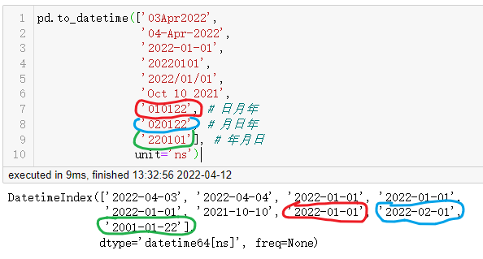
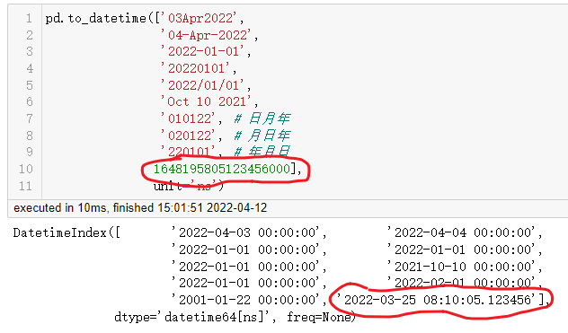

# 拯救pandas计划（11）——转换DataFrame内的字符串型日期为日期类型

最近发现周围的很多小伙伴们都不太乐意使用pandas，转而投向其他的数据操作库，身为一个数据工作者，基本上是张口pandas，闭口pandas了，故而写下此系列以让更多的小伙伴们爱上pandas。

系列文章说明：

> 系列名（系列文章序号）——此次系列文章具体解决的需求

**平台：**

- windows 10
- python 3.8
- pandas >=1.2.4

## / 数据需求

目前有这么一列日期数据，不过是以字符串类型显示的，需要转换成日期类型。

|     | date                |
| ---:|:------------------- |
| 0   | 2021-11-27 00:00:00 |
| 1   | 2021-12-17 00:00:00 |
| 2   | 2021-12-17 00:00:00 |
| 3   | 2021-12-16 12:00:00 |
| 4   | 2021-12-17 00:00:00 |
| 5   | 2021-12-17 00:00:00 |
| 6   | 2021-12-02 00:00:00 |
| 7   | 2021-11-13 00:00:00 |
| 8   | 2021-12-17 00:00:00 |
| 9   | 2021-11-18 12:00:00 |
| 10  | 2021-12-16 12:00:00 |

## / 需求拆解

在python中就有很多关于日期处理的库，数最常见常用的就是`datetime`库了，在`pandas`里也有处理日期的方法`pandas.to_datetime`，粗略的看了下该方法的解释文档，基于`datetime`库做了更多扩展，在`pandas`里使用`to_datetime`方法更轻便的转换日期类型数据。

## / 需求处理

在这一例中，可以简单使用`pd.to_datetime(data['date'])`即可，不用指定转换的类型，它会自动寻找到符合的日期类型进行转换。

```python
>>> import pandas as pd
>>> df = ...

>>> df['date'].values
array([['2021-11-27 00:00:00'],
       ['2021-12-17 00:00:00'],
       ['2021-12-17 00:00:00'],
       ['2021-12-16 12:00:00'],
       ['2021-12-17 00:00:00'],
       ['2021-12-17 00:00:00'],
       ['2021-12-02 00:00:00'],
       ['2021-11-13 00:00:00'],
       ['2021-12-17 00:00:00'],
       ['2021-11-18 12:00:00'],
       ['2021-12-16 12:00:00'],
       ['2021-12-14 12:00:00'],
       ['2021-12-17 00:00:00']], dtype=object)

>>> pd.to_datetime(df['date'])
```

本例的需求非常容易解决，再稍微探索下它更多的用法。

```shell
pd.to_datetime(
    arg: Union[~DatetimeScalar, List, Tuple, ~ArrayLike, ForwardRef('Series')],
    errors: str = 'raise',                # 产生错误的处理方式
    dayfirst: bool = False,               # 日在首位
    yearfirst: bool = False,              # 年份在首位
    utc: Union[bool, NoneType] = None,    # 是否返回时区
    format: Union[str, NoneType] = None,  # 格式
    exact: bool = True,                   # 是否精确地按格式匹配
    unit: Union[str, NoneType] = None,    # 时间单位，默认ns
    infer_datetime_format: bool = False,  # 根据判断第一个日期作为基准，较少后续的日期推断
    origin='unix',                        # 参考日历
    cache: bool = True,
)
```

它的参数都是很有作用的，但也是有常用与不常用的区分，如需了解所有参数的含义，可以参考官方文档及python的内置模块[datetime](https://docs.python.org/3/library/datetime.html#strftime-and-strptime-behavior)。下面分享几个我常用的。

- errors，转换过程中发生错误处理

有三个选项，分别为：raise，coerce，ignore，设定后效果分别为：立即返回报错，中断代码运行；将不能转换的值用`pd.NaT`代替返回；忽略报错，使用原值返回，这里有个误区，只要有错误发生，它不会单独跳过这一不能转换的值，而是不会转换所有的数据以原数据类型返回。

- format，输入的日期格式

当输入的日期不能让`pd.to_datetime`很好的识别转换时，就轮到它上场了。更多格式用法转：**[datetime]**`https://docs.python.org/3/library/datetime.html#strftime-and-strptime-behavior`

样例：

```python
pd.to_datetime(['03Apr2022', 
                '04-Apr-2022', 
                '2022-01-01', 
                '20220101', 
                '2022/01/01', 
                'Oct 10 2021', 
                '010122', # 日月年
                '020122', # 月日年
                '220101'], # 年月日
               unit='ns')
```



可以看到几个对应颜色的再转换过程出了点意外，在未设置format参数时，都可以很好的转换，在需要转换的日期列中，只要格式不是特别特殊的情况下完全不用设置format参数。

因为后面三个日期数据的年份是用两个字符组成的，且位置漂浮不定，这时设置format，设置之后也只能特定日期做转换，用法看参照`datetime.datetime.strptime`

```python
# 不接收单独字符串传入，可以使用列表，元组等其他容器类型将日期字符串放进去
# 转换'010122' 日月年
>>> pd.to_datetime(['010122'], format='%d%m%y')
DatetimeIndex(['2022-01-01'], dtype='datetime64[ns]', freq=None)

# 转换'020122' 月日年
>>> pd.to_datetime(['020122'], format='%m%d%y')
DatetimeIndex(['2022-02-01'], dtype='datetime64[ns]', freq=None)

# 转换'220301' 年月日
>>> pd.to_datetime(['220301'], format='%y%m%d')
DatetimeIndex(['2022-03-01'], dtype='datetime64[ns]', freq=None)
```

其他格式类似。

- infer_datetime_format，将后续的日期格式用第一个转换的日期格式匹配，默认False。

这个参数在提高转换效率上有很大的帮助，在没有设定format的情况下，将这个参数设定为True（infer_datetime_format=True），需要转换的日期类型格式高度一致时，可以极大地减少转换时间，官方称能提高5至10倍的效率。也就是说它会蒙第一个需要转换的日期格式，蒙对后，后续的日期转换都按这个来，不用再去蒙格式了。

- unit，时间单位，默认ns

上面的例子中的都是对字符串转换，也有提到过几乎不用设置日期格式就能转换日期，还有一种在日期操作中经常会遇见的格式，就是时间戳类型的数据，这个转换为日期当然也不在话下，同样可以与上述日期转换混合在一起使用，而又注意到，转换后的时间单位都是ns，所以在未设置unit参数为其他单位时，需要传入ns为单位的时间戳数据。



可以针对时间戳数据设置不同的unit参数来转换，当然同次转换的列中单位理应一致。

```python
# ms
>>> pd.to_datetime([1648195805123], unit='ms')
DatetimeIndex(['2022-03-25 08:10:05.123000'], dtype='datetime64[ns]', freq=None)

# s
>>> pd.to_datetime([1648195805], unit='s')
DatetimeIndex(['2022-03-25 08:10:05'], dtype='datetime64[ns]', freq=None)

# D
>>> pd.to_datetime([19076], unit='D')
DatetimeIndex(['2022-03-25'], dtype='datetime64[ns]', freq=None)
```

- origin，其实日期设置

可能会好奇这些数怎么会能够跳跃到当前日期。在这里都是因为`origin`参数的设定，默认是`unix`，即起始时间为`时区为0时区的1970-01-01`，所以为什么在使用pd.to_datetime的时候，特别在用时间戳转换时间中有时会不对，则是此中的道理，固然可以设置origin参数，使时间戳在这个基准上进行相加，直至转换完成。

```python
>>> pd.to_datetime([1, 2, 3], unit='D', origin=pd.Timestamp('1960-01-01'))
DatetimeIndex(['1960-01-02', '1960-01-03', '1960-01-04']
```

## / 总结

相信都已经了解了`pd.to_datetime`的相关用法，在`pandas`日期数据转换中不妨试试`pd.to_datetime`方法，结合了`datetime`库中`datetime.strptime`函数，减少其中部分参数的使用，在项目使用过程中也可以较少在意当日期格式发生变化时需要去调整日期格式，减少错误的发生，`pandas`中也沿用了许多`datetime`库中的函数，更多格式类型可参考`datetime`的使用文档。

这本该是青葱杨柳的天气，还是牡丹海棠的时节？

---

<p align="right">于二零二二年四月十二日作</p>
