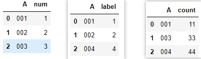
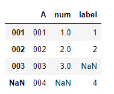
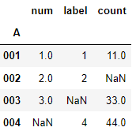
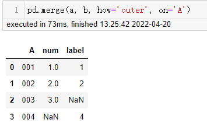
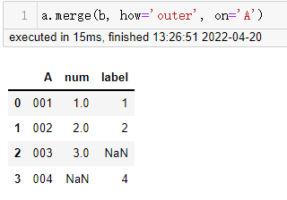
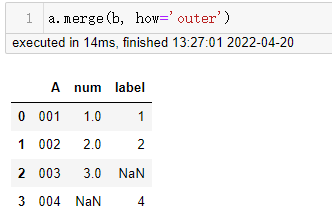
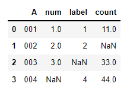
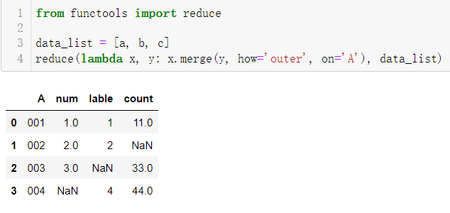
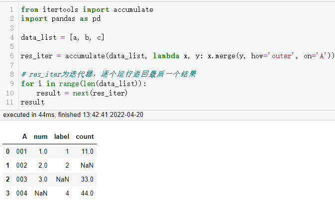

# 拯救pandas计划（14）——merge合并多个数据框

最近发现周围的很多小伙伴们都不太乐意使用pandas，转而投向其他的数据操作库，身为一个数据工作者，基本上是张口pandas，闭口pandas了，故而写下此系列以让更多的小伙伴们爱上pandas。

系列文章说明：

> 系列名（系列文章序号）——此次系列文章具体解决的需求

**平台：**

- windows 10
- python 3.8
- pandas >=1.2.4

## / 数据需求

对以下三组数据框，按`A`列进行横向合并，如同`SQL`里join表操作，最后生成的列名有`A, num, label, count`四列。  
```python
import pandas as pd

a = pd.DataFrame({'A': ['001', '002', '003'],
                 'num': [1, 2, 3]})
b = pd.DataFrame({'A': ['001', '002', '004'],
                 'lable': ['1', '2', '4']})
c = pd.DataFrame({'A': ['001', '003', '004'],
                 'count': [11, 33, 44]})
```

  

## / 需求拆解

数据合并在python中并不少见，例如列表的`append`，`extend`，`+`都可以扩增列表元素，字典的`update`也可以根据另一个字典来更新当前字典的元素。  

在`pandas`里也不例外，有许多合并的函数方法，如`concat`，`join`，`merge`。  

`concat`不会要求合并的数据框形式是否一致，只要符合合并的类型就能够进行合并。  

`join`需要设定合并数据的基准列，在该例中为A列，且需要将其设置为索引方可进行合并，在pandas中并不能直接使用`join`方法，在`DataFrame()`类下才能使用。  

`merge`可以合并左表数据框和右表数据框，从描述来看`merge`只能两两合并，其合并的方式和join类型，在参数设置上有些许不同，不需要将基准列设置在索引上，也可以不设置基准列，会自动寻找两表之间相同的列名作为基准列进行合并。

## / 需求处理

数据框的上下左右合并，使用`concat`设置对应的axis的参数就可以轻松解决。  

若要满足需求来合并几个数据框，`concat`就需要靠边了。先使用比较易理解的`join`，在sql语句中连接两个表是非常常见的。  

- join

因为pandas下不能直接调用join，在a数据框后连接其他数据框。  

```python
# 以a数据框作为基础表，连接另外两个数据框
# 上文提到，需要将基准列设置为索引才能连接  
# on设置连接的列名，此时已处于索引上，当为多个值时，被连接对象需要含多级索引  
# how连接方式，默认为`left`，左连接，这里设置为`outer`，外连接方式
a.set_index('A').join(b.set_index('A'), on='A', how='outer')
```

  

已经按`A`列各元素合并了其他列，若对应列下没有用`nan`填充，可以看到`A`列仍为列名称。  

尝试合并多表：  

```python
# 这里设置on参数会报错，原因未去探究
a.set_index('A').join([b.set_index('A'), c.set_index('A')], how='outer')
```



能够完成需求，此时注意到`A`列数据已作为索引列出现，在合并两个数据框时，取消`on`参数的设置，同样会使`A`列作为索引列。  

（手动水印：原创CSDN宿者朽命，https://blog.csdn.net/weixin_46281427?spm=1011.2124.3001.5343 ，公众号A11Dot派)

- merge  

在前文中提到，`merge`只能对两个数据框进行操作，在`pandas`下可以直接使用`merge`方法，也可以在数据框下调用方法，参数无区别。

```python
# pd.merge  
pd.merge(a, b, how='outer', on='A')  
# a.merge(b) - 1  
a.merge(b, how='outer', on='A')  
# a.merge(b) - 2  
a.merge(b, how='outer')
```

  

  

  

三种形式生成的结果是一样的，而需要连接第三个表只需要将前两个的连接的结果与第三个表相连接就行。  

```python
a.merge(b, how='outer', on='A').merge(c, how='outer', on='A')
```

  

当需要连接的数据框比较多时，一个一个写就比较费力，可以使用for循环来完成这一目的，可以使用`reduce`函数来处理这样逐步累积的效果，为了更符合实际操作，将数据框放置到一个列表容器里。  
```python
from functools import reduce

data_list = [a, b, c]
reduce(lambda x, y: x.merge(y, how='outer', on='A'), data_list)
```
  

在`itertools`模块下有一个类似于`reduce`的累加迭代器`accumulate`，也可以替换for循环。  

```python
from itertools import accumulate
import pandas as pd

data_list = [a, b, c]

res_iter = accumulate(data_list, lambda x, y: x.merge(y, how='outer', on='A'))

# res_iter为迭代器，逐个运行返回最后一个结果
for i in range(len(data_list)):
    result = next(res_iter)
result
```

`accumulate`迭代器将传入的可迭代对象参数（第一个参数），以func函数（第二个参数）需要的参数获取所需数量的参数个数进行操作计算，将每次运行的结果返回至迭代器中，之后的计算中，根据上一次计算的结果作为x参数，当前入参作为y参数依次迭代返回，迭代器结果的最后一个元素就是想要得到的目标值。

  

## / 总结

正如古话说，条条道路通罗马。其实不用在意方法的多样性，找到符合自己的解决方式就行了，使用的方法越高级，在当时学习中理解难度就会越高，有朝一日能够理解高级方法的含义时再回来使用它也是可以的。  

闲日赏花两支半，叹有青空风筝留。

---

<p align="right">于二零二二年四月二十日作</p>
