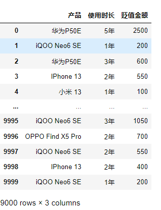
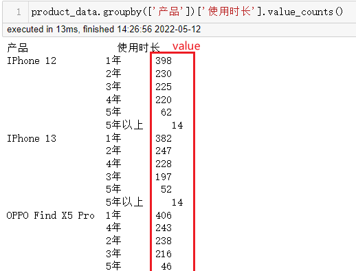
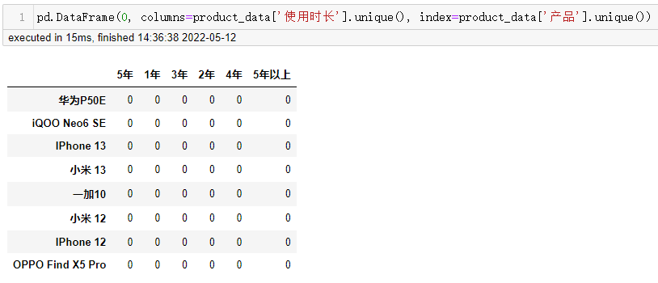
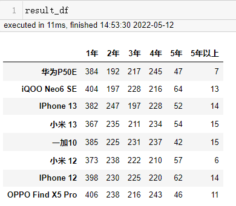
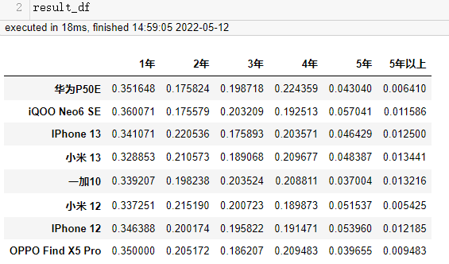
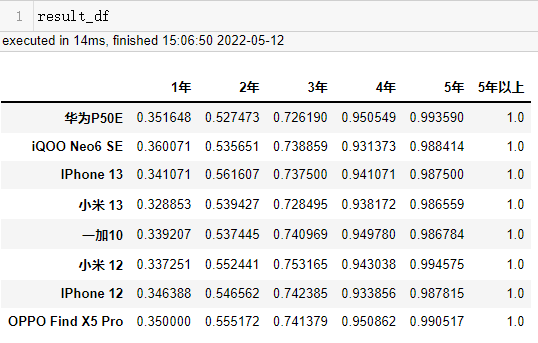
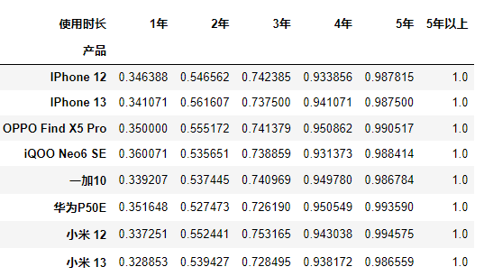
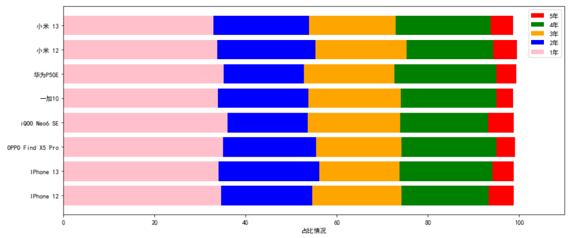

# 拯救pandas计划（15）——计算累积和并绘制堆叠图

最近发现周围的很多小伙伴们都不太乐意使用pandas，转而投向其他的数据操作库，身为一个数据工作者，基本上是张口pandas，闭口pandas了，故而写下此系列以让更多的小伙伴们爱上pandas。

系列文章说明：

> 系列名（系列文章序号）——此次系列文章具体解决的需求

**平台：**

- windows 10
- python 3.8
- pandas >=1.2.4

## / 数据需求

对以下数据中分析各产品的各个使用时长的数量在该产品中的数量占比，并按年份从小到大绘制堆叠图。  

  

## / 数据准备

本例数据为随机生成数据，用以下代码生成：  

```python
random_seed = 2022
length = 10000

phone_list = ['IPhone 13', '小米 13', '小米 12', 'IPhone 12', 'iQOO Neo6 SE', '华为P50E', 'OPPO Find X5 Pro', '一加10']
used_year_list = ['1年', '2年', '3年', '4年', '5年', '5年以上']
lost_money_list = [np.linspace(100, 500, 5, dtype=int),
                  np.linspace(400, 1000, 5, dtype=int),
                  np.linspace(600, 1500, 5, dtype=int),
                  np.linspace(800, 2000, 5, dtype=int),
                  np.linspace(1000, 3000, 5, dtype=int),
                  np.linspace(1500, 4000, 5, dtype=int)]

# 设定随机种子，使每次随机结果一致
np.random.seed(random_seed)
phones = np.random.choice(phone_list, length)
used_year = np.random.choice(used_year_list, length, p=[0.34, 0.2, 0.2, 0.2, 0.05, 0.01])
# 随机生成贬值金额
def choose_money(choice_list, p=[0.3, 0.3, 0.2, 0.1, 0.1]):
    return np.random.choice(choice_list, 1, p=p)[0]

product_data = pd.DataFrame({'产品': phones,
                    '使用时长': used_year})
# 随机删除1000条已生成的数据
product_data.drop(index=np.random.permutation(length)[:int(length * 0.1)], inplace=True)
product_data['贬值金额'] = product_data['使用时长'].map(lambda x: choose_money(lost_money_list[used_year_list.index(x)]))  
# product_data
```

或者下载链接数据，已将生成的随机数据保存为gzip文件，用以下方式读取即可：  

文件链接：https://github.com/lk-itween/FunnyCodeRepository/raw/main/PandasSaved/data/random_product_lost_money_data.gz  

```python
# 如果下载文件不在当前工程路径，请使用绝对路径导入文件
product_data = pd.read_csv('random_product_lost_money_data.gz', encoding='utf-8')
```

## / 思路解析

如何统计每个产品的各个使用时长的数量，每个产品就是分组（`groupby`），数量统计就是（`value_counts`），将方法链式调用有：  

```python
product_data.groupby(['产品'])['使用时长'].value_counts()
```

  

生成的是一个含多级索引的Series对象。离目标样式相差甚远，样式类似于下图所示：  

  

假设在不知道其他用法的情况下，将groupby后的对象转成样式表的样例，需要遍历groupby后的结果，逐一赋值到样式表中。  

```python
result_df = pd.DataFrame(0, columns=product_data['使用时长'].unique(), index=product_data['产品'].unique())
used_year_df = data.groupby(['产品'])['使用时长'].value_counts()

# 逐一遍历，将值赋值给样式表
for (i, j), value in used_year_df.items():
    result_df.loc[i, j] = value  
```

  

计算各产品的每列的占比，需要分别求和，再分别求商（可运用`numpy`数组的广播机制）。  

```python
result_df.loc[:, result_df.columns] = result_df.values / result_df.values.sum(axis=1).reshape(len(result_df), 1)
```

   

为了在绘制堆叠图时，能够比较轻松地编写代码，可以在这一步将每个产品进行累加求和，然后通过`for`循环，从使用时长最大到最小依次绘制柱状图即可实现堆叠图。  

```python
result_df = result_df.cumsum(axis=1)  
# 或者使用扩展性更强的expanding方法  
result_df = result_df.expanding(axis=1).sum()
```

  

在之前的几篇 *拯救pandas计划系列* 文章里，有接触过如何将一维表展开成二维表。  

（手动水印：原创CSDN宿者朽命，https://blog.csdn.net/weixin_46281427?spm=1011.2124.3001.5343 ，公众号A11Dot派）  

可以在`groupby`后面使用`unstack`将索引转换为列名，也可以使用交叉表`crosstab`函数进行计算统计，进行百分比计算时，也只需要添加参数`normalize`就可以轻易计算。  

- groupby -> unstack  

```python
product_data.groupby(['产品'])['使用时长'].value_counts(normalize=True).unstack().cumsum(axis=1)
```

- pd.crosstab  

```python
pd.crosstab(product_data['产品'], product_data['使用时长'], product_data['使用时长'], aggfunc='count', normalize='index').cumsum(axis=1)
```

除都在末尾链式调用了`.cumsum(axis=1)`计算累积和之外，使用了不同的方法完成各产品的计数。  

`groupby`进行分组后，对每组进行`value_counts`计数，同时进行规范化，而后将`使用时长`的这一索引转换为列名。  

`crosstab`将`产品`作为索引，`使用时长`即作为列名，又作为统计对象进行计数，`normalize='index'`对结果按行进行规范化。  

  

接下来绘制堆叠图，前面有提到，要将使用时长最长的先绘制，后面时长小的再覆盖，就能在图形上看到各个使用时长的占比情况。  

```python
from matplotlib import pyplot as plt

# 设置字符，可显示中文
plt.rcParams['font.sans-serif'] = ['SimHei']
plt.rcParams['axes.unicode_minus']=False

# 图形大小
plt.figure(figsize=(14, 6))
# 颜色列表
colors = ['red', 'green', 'orange', 'blue', 'pink']
# 按使用时长从大到小依次绘制
for num, col in enumerate(['5年', '4年', '3年', '2年', '1年']):
    plt.barh(product_data.index, product_data[col].values * 100, color=colors[num], label=col)

plt.xlim(0, 110)  # 扩展轴，以能正常显示图例
plt.xlabel('占比情况')
plt.legend()
plt.show()nd()
plt.show()
```

  

将值乘以100，用百分比的形式呈现，仅绘制了【1年~5年】的情况。可根据各颜色的长度来观察各产品间各使用时长的数量占比情况。  

## / 总结

以上通过求得累积和来完成堆叠的绘制，多种类含有相同类型字段时，需要转换为二维数组的灵活运行，使用已有的函数方法来代替遍历赋值操作，减少代码的同时更能轻松地得知代码的实现目的。  

每个人都有低落的时候，可以借助别的让这份失落的心情随风而去吧，不用等到明天，下一秒就会更好。  

---

<p align="right">于二零二二年五月十二日作</p>


