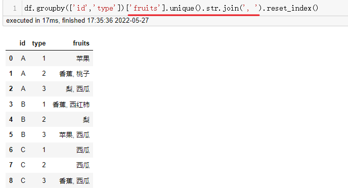

# 拯救pandas计划（17）——对各分类的含重复记录的字符串列的去重拼接

最近发现周围的很多小伙伴们都不太乐意使用pandas，转而投向其他的数据操作库，身为一个数据工作者，基本上是张口pandas，闭口pandas了，故而写下此系列以让更多的小伙伴们爱上pandas。

系列文章说明：

> 系列名（系列文章序号）——此次系列文章具体解决的需求

**平台：**

- windows 10
- python 3.8
- pandas >=1.2.4

## / 数据需求

在一组数据中，由于未知名原因导致数据重复录入，重复数据在处理过程中大概率是不必要，如下有一组模拟数据，需要将`fruits`列中数据按`id，type`分类后并且将各个名称以逗号`,`拼接成一条数据，需要将重复分类下的名称去重处理。  

```python
import pandas as pd

df = pd.DataFrame( {'id' : np.tile((['A'], ['B'], ['C']), 6).flatten(), 
                    'type' : np.tile((1, 2, 3), 6), 
                    'fruits' : ['苹果', '香蕉', '梨', '苹果', '桃子', '西瓜', '香蕉', '梨', '苹果', '西红柿', '梨', '西瓜', '西瓜', '西瓜', '香蕉', '西瓜', '西瓜', '西瓜']})
```

  

## / 需求拆解

整个需求很简单，然而需要将这个精简成一个标题却想破了脑皮，每个大分类下有几个小分类，每个小分类有多条数据，需要将多条记录进行合并拼接，如['苹果', '香蕉']拼接成'苹果, 香蕉'，而多条数据可能有重复记录，合并的同时不需要将重复的情况考虑在内，如果已经出现苹果了，就不需要再次拼接苹果，综合考虑下，觉得先将数据去重再考虑拼接。  

具体方式及代码如下。  

## / 需求处理

- drop_duplicates

在[拯救pandas计划（4）——DataFrame分组条件查找值](https://mp.weixin.qq.com/s/VNkAYYVGMibCzdjDRSSkgQ)有提到过关于分组数据重复处理方法，直接用`drop_duplicates()`删除掉重复记录再拼接。

```python
df.drop_duplicates().groupby(['id', 'type'], as_index=False).agg(lambda x: ', '.join(x))
```

  

设置在（A, 1)分类中多余的苹果去除掉了。  

分组后的传入到`lambda`中的x是`Series`对象，`join`拼接传入参数为可迭代对象，在日常处理中可能看到比较多的拼接列表，在潜意识里可能认为只能对列表操作，在这里依然可以进行拼接返回一个字符串。  

（手动水印：原创CSDN宿者朽命，https://blog.csdn.net/weixin_46281427?spm=1011.2124.3001.5343，公众号A11Dot派） 

- set  

去重既可以在聚合前去重，也可以在聚合中去重，每个分类之间的重复数据互不干扰，又了解集合中的数据是唯一的，则可以将聚合后的数据转成set后再拼接。  

```python
df.groupby(['id', 'type']).agg(set)['fruits'].map(lambda x: ', '.join(x)).reset_index()
```

  

这里注意，`agg(set)`后是`DataFrame`对象，需要索引出`fruits`列，才可以继续往下操作，可能会注意与上一方法不同点，在重置索引时放在了最后，为能让`fruits`列正常被拼接，需要将聚合列作为索引列处理，最后才重置索引为列。  

- unique  

在`agg(set)`有许多需要注意的地方，可以使用更符合操作的方法，`.unique()`，在`Series`中`unique()`去重方法，而在`Groupby`对象里可以使用列名取出列`Series`对象。  

```python
df.groupby(['id','type'])['fruits'].unique().str.join(', ').reset_index()
```

  

`fruits`列本身是一个字符串类型，相比于上两种又可以使用更为特性的拼接方法`.str.join()`，按行遍历，对每行的数据进行拼接，这里的行中的元素不一定为列表，与`''.join`类型，为可迭代对象即可。上文提到，`unique`是属于`Series`中的一种方法，依然需要在所有分类去重拼接处理完后再将索引重置为列。  

需要注意的是，`Groupby`对象使用`apply`方法是对元素视为`Series`对象，则不能将列名作为关键字进行引用。  

## / 总结

对分类数据的去重处理，方式多样，这篇文章仅选取符合`pandas`的几种处理方式，仅做加深个人理解分组函数及其相关方法的使用。数据样式千变万化，在多种多样的数据通过不同的函数方法有效地处理。  

问门前落叶几片，答曰河中鱼两条。  

--- 

<p align="right">于二零二二年五月二十七日作</p>
