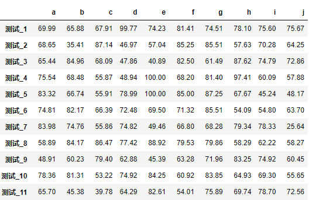
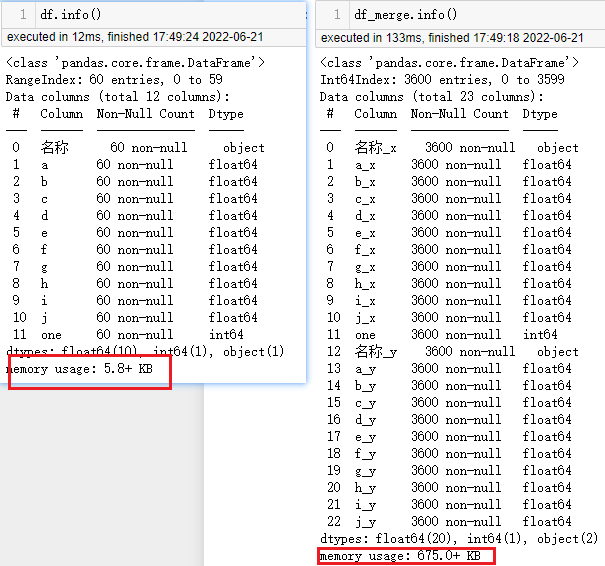
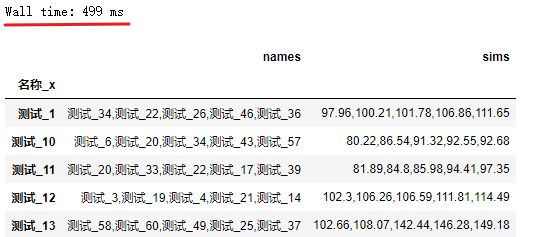
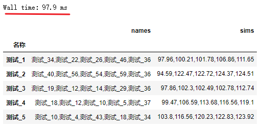

# 拯救pandas计划（19）——使用自定义方法计算两列的相似度

最近发现周围的很多小伙伴们都不太乐意使用pandas，转而投向其他的数据操作库，身为一个数据工作者，基本上是张口pandas，闭口pandas了，故而写下此系列以让更多的小伙伴们爱上pandas。

系列文章说明：

> 系列名（系列文章序号）——此次系列文章具体解决的需求

**平台：**

- windows 10
- python 3.8
- pandas >=1.2.4  

## / 数据需求

最近在互联网遨游时偶然发现一道很有趣的pandas实例训练题目，题目距今已发布很久，也已经有人为此解答过了，说：有一组数据，每列分别记录着样品的各个指标情况，欲对每个数据各个指标进行计算，求各个样品之间的指标差值的绝对值的总和最小的对应的几个样品，如：`a样品：[10.0, 9.0, 7.5, 8.6]`，`b样品：[11.2, 8.7, 6.4, 5.5]`之间的相似度计算为：`|10.0-11.2|+|9.0-8.7|+|7.5-6.4|+|8.6-5.5|`。  

对应位置相减取绝对值后再相加，为每个样品对其余样品进行计算，求得所有样品的与其相似度最小的5个其他样品。  

根据上述描述，构造一组随机数据：  

```python
import numpy as np
import pandas as pd

np.random.seed(2022)
data = np.clip(np.random.normal(loc=70, scale=15, size=600).round(2), 0, 100).reshape(60, 10)
df = pd.DataFrame(data, columns=list('abcdefghij'), index=[f'测试_{i}' for i in range(1, 61)])
```

数据大小为：60\*10，浮点型类型。  

  

## / 需求处理

- 方法一：  笛卡尔积

先计算每个样品的交叉数据，再分组获取组内排名在上的5个数据。  

这个方法是该题目下方解答者大佬的方法，其使用的方法进行笛卡尔乘积非常有意思。  

```python
df = df.reset_index().rename(columns={'index': '名称'})  
# 设置辅助列
df['one'] = 1
# merge自身，以one列作为key参数合并数据框
df_merge = pd.merge(left=df, right=df, left_on='one', right_on='one')
```

原数据大小为60\*10，乘积后为3600行，内存占用大小相比处理前大了不少，如果数据过大，在处理方面，耗时上会显著增加。  

  

暂且不考虑数据量的影响，继续处理。  

```python
# 剔掉名称列和one列
columns = list(df.columns)
columns.remove('名称')
columns.remove('one')


def sim_fun(row):
    sim_value = 0.0
    for col in columns:
        sim_value += abs(round(row[col+'_x'] - row[col+'_y'], 2))
    return round(sim_value, 2)

# 求出每个样品之间的相似值
df_merge['sim'] = df_merge.apply(sim_fun, axis=1)
df_merge = df_merge[df_merge['名称_x'] != df_merge['名称_y']].copy()

# 获取每个样品与其相似值最小的5个样品
def get_top_sims(df_sub):
    df_sort = df_sub.sort_values('sim').head(5)
    names = ','.join(df_sort['名称_y'])
    sims = ','.join(df_sort['sim'].astype(str))
    return pd.Series({'names': names, 'sims': sims})

df_result = df_merge.groupby('名称_x').apply(get_top_sims)
```

通过复现解答大佬的代码如上，顺利返回了相似度前五的数据框。可以看到在60条数据中使用笛卡尔积进行计算，耗用时间是可以接受的。  

  

- 方法二：将每一行数据与原数据直接相减，利用pandas特性求和  

在方法一中能注意到数据处理上稍有繁琐，将数据扩容再处理，且数据的差值为逐个计算。仔细理解数据，可以利用数组的广播特性进行处理。  

```python
def get_sims(s):
    # 注意：此处的df为全局变量
    df_sim = (df - s).abs().sum(axis=1).round(2)
    df_sim.pop(s.name)
    df_sim = df_sim.sort_values(ascending=False).head(5).astype(str)
    return pd.Series({'names': ','.join(df_sim.index), 'sims': ','.join(df_sim.values)})

# apply按行遍历数据，使其他行与该行进行数据计算
df_result = df.apply(get_sims, axis=1)
```

使用广播的特性将方法一中的函数优化为`get_sims`函数，在计算效率上也大大提高。  

  

## / 总结

本文通过了解题目目的及其他解答者的想法，根据自身掌握的`pandas`技巧对题目进行分析处理，在一定程度上减少数据计算的冗余度，满足数据需求，如对本文有不理解之处，尽可发言表述自己的想法。  

独乐乐不如众乐乐。  

--- 

<p align="right">于二零二二年六月二十一日作</p>
