# 拯救pandas计划（21）——获取指定日期所属月的月初月末

最近发现周围的很多小伙伴们都不太乐意使用pandas，转而投向其他的数据操作库，身为一个数据工作者，基本上是张口pandas，闭口pandas了，故而写下此系列以让更多的小伙伴们爱上pandas。

系列文章说明：

> 系列名（系列文章序号）——此次系列文章具体解决的需求

**平台：**

- windows 10
- python 3.8
- pandas >=1.2.4

## / 数据需求

最近在看一本关于使用pandas进行数据处理的书，于2020年出版，其中有一段对在线零售商品的销售日期的处理，获取日期列中对应的月初日期。数据读取如下：  

```python
import pandas as pd

# 按照书中代码，将InvoiceDate解析成日期类型
df = pd.read_csv('Online_Retail.csv.zip', parse_dates=['InvoiceDate'])
df = df.dropna().copy()
```

**ps:** 数据获取方式，后台回复【零售】。  

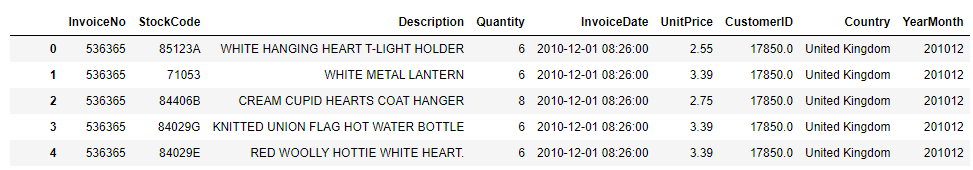  

(406829, 9)    

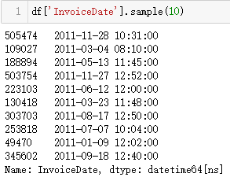   

## / 需求处理

众所周知，在现行日历下每月的月初是当月的1号，获取的方法也有很多，本文列举一二。  

- datetime设定  

在书中例子中给定的代码就是将年月日分离，再将1号拼接成新的日期数据。  

```python
def get_month_start(x):
    return datetime(x.year, x.month, 1)
df['MonthStart'] = df['InvoiceDate'].map(get_month_start)
```

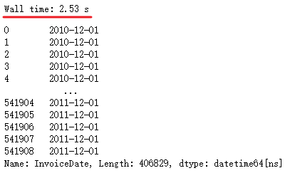  

- pandas...MonthBegin, MonthEnd

`pandas`中也有对时间变量进行处理的函数，获取月初月末日期也是可以不用自己拟写逻辑。但使用时需注意，以下为演示过程中出现的部分情况及对应的解决办法。  

```python
from pandas.tseries.offsets import MonthBegin, MonthEnd  

# 构造演示样例  
df2 = pd.to_datetime(['2022-9-1', '2022-9-2', '2022-9-29', '2022-9-30', 
                      '2022-10-1', '2022-10-2', '2022-10-30', '2022-10-31']).to_frame(name='date')
```

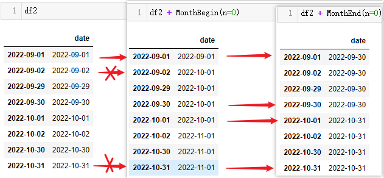  

将间隔参数`n`设置成0，即为获取当月的月初月末日期，在图中可以清晰的看出当仅为月初日期时才能正确的获取当月月初日期，其余日期将获取成下月月初日期，而月末日期可以正确获取。  

再将间隔参数`n`设置为1，获取下一月日期，效果如下：  

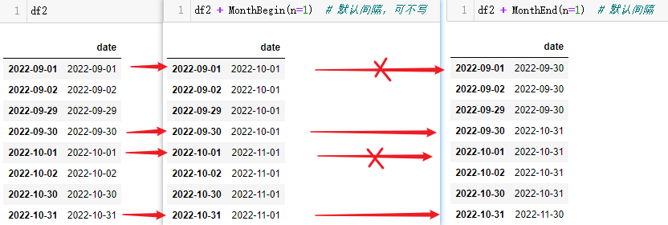  

此时月初函数是可以正确获取到下一月的月初日期，而月末函数只有当日期为月末时才能正确获取下月月末日期。  

如何正确获取上述错误情况的日期，已正确获取的不再赘述，可得知，获取下月初的情况和获取本月末的函数是对的，可以对正确的结果做一次加减法后转换成正确的目标值。  

> 本月月初：
> 
> 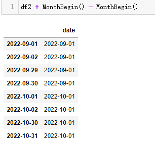  

> 下月月末：  
> 
> 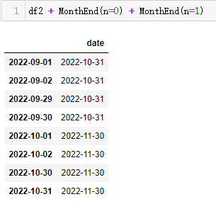   

df['InvoiceDate']中的日期数据是包含时间的，在获取月初月末时并不会将时间给剔掉，使用`.dt.floor('D')`截取成日期后再获取。  

```python
df['InvoiceDate'].dt.floor('D') +  MonthBegin() - MonthBegin()
```

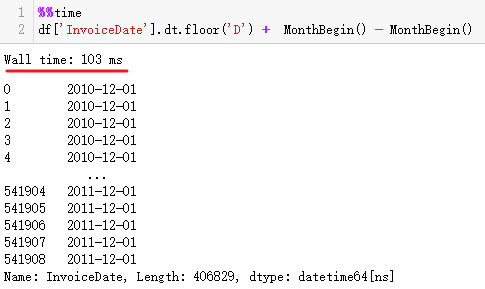  

使用这个方法转换所需时间相比书中给出的方法是非常少的。  

（手动水印：原创CSDN宿者朽命，https://blog.csdn.net/weixin_46281427?spm=1011.2124.3001.5343 ，公众号A11Dot派)   

- period('M')的dt方法  

在pandas中可以生成周期型的日期数据，当然可以将日期转换成周期，本篇需要获取的是月初月末日期，则需要将日期转换成以月为单位的周期数据。  

```python
df3 = pd.period_range('2021-10', '2022-05', freq='M').to_frame(name='date')
```

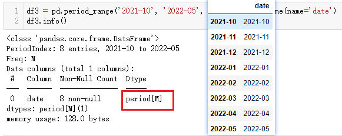  

生成了一组以月为周期的日期数据。对于已经是日期类型的数据可以使用`.dt.to_period`方法进行转换。  

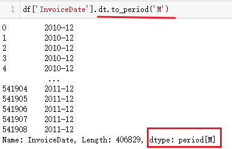  

周期型数据相比日期的`dt`方法，多了`start_time`和`end_time`，分别获取当前日期的月初日期和月末日期。  

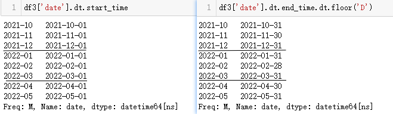  

由于`end_time`会直接返回毫秒级的最后一个时刻，需要用`floor`截取出日期。  

还可以用`dt.asfreq`获取月初月末日期，接受两个参数：  

```shell
freq : str  # 一个频率参数，如A代表年，M代表月，D代表日
how : str {'E', 'S'}
    # 最后： 'E', 'END', or 'FINISH' for end,
    # 开始： 'S', 'START', or 'BEGIN' for start.  
```

需要将月周期转换为日周期，结果为当月的开始，可以这样设置：  

```python
df3['date'].dt.asfreq('D', how='S')
```

若要返回的是月的结束，则可以这样设置，参数名称非必要，默认的结束日期：

```python
df3['date'].dt.asfreq('D', 'E')
```

对比两种在示例数据中的耗时情况。  

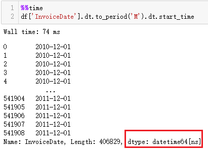  

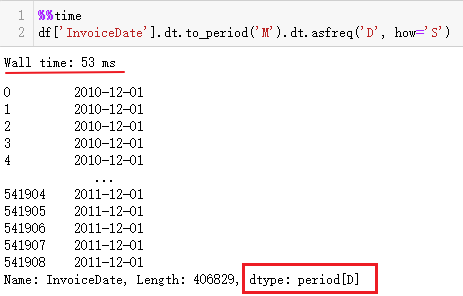  

`asfreq`似乎要比`start_time`耗时短一点，同时注意到转换后的结果类型不一样，两个的dt方法的部分属性、方法有所不同，若需要将周期类型转换成日期类型，可以将`asfreq`更改成`to_timestamp`，参数一致，耗时略微长一点，结果与`start_time`类似。  

**注：**     

1. 文章使用数据为日期类型，若日期作为字符串`Series`类型，可通过pd.to_datetime(s, format)，将format设定为对应格式参数转换成日期类型后再测试文章提及的几种方法。    

2. 源数据可通过文章开头处获取。

## / 总结

本文通过引入示例，分别阐述`pandas`在获取月初月末日期的几种方法，显然还有其他的方法进行获取，`pandas`中将日期处理成向量化的操作，相较于初始化`datetime`类型数据，方法简便、高效，在系列文章的前几篇也有提到过，向量化的操作普遍比参数定义，初始化的执行效率上要高。  

骤雨狂风欲催人倒，定叫天公刮目相看。  

--- 

<p align="right">于二零二二年六月二十四日作</p>
