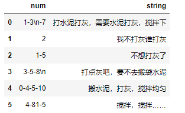
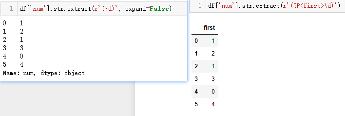
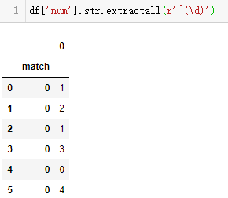
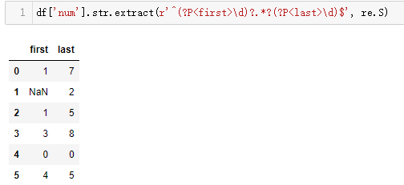
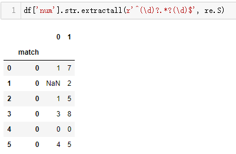
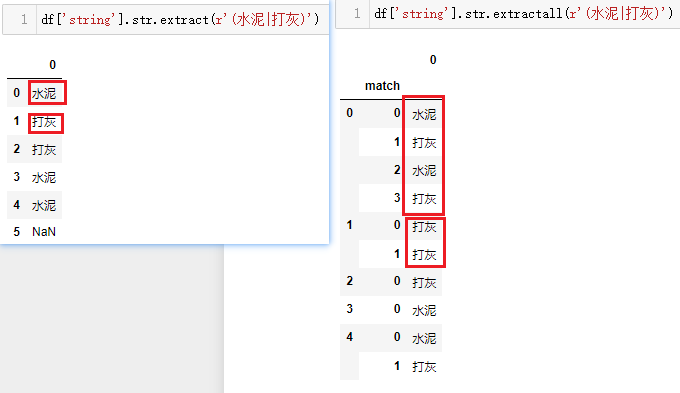
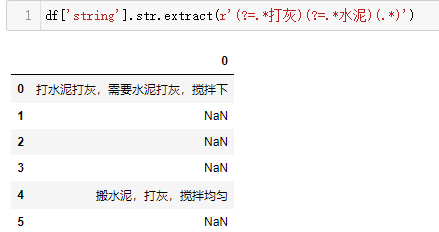
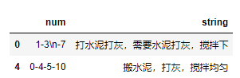

# 拯救pandas计划（22）——再话extract和extractall

最近发现周围的很多小伙伴们都不太乐意使用pandas，转而投向其他的数据操作库，身为一个数据工作者，基本上是张口pandas，闭口pandas了，故而写下此系列以让更多的小伙伴们爱上pandas。

系列文章说明：

> 系列名（系列文章序号）——此次系列文章具体解决的需求

**平台：**

- windows 10
- python 3.8
- pandas >=1.2.4

## / 数据需求

对指定列提取指定字符。  

```python
import pandas as pd

data = {
    'num': ['1-3\n-7', '2', '1-5', '3-5-8\n', '0-4-5-10', '4-81-15'],
    'string': ['打水泥打灰，需要水泥打灰，搅拌下', '我不打灰谁打灰', '不想打灰了', '打点灰吧，要不去搬袋水泥', '搬水泥，打灰，搅拌均匀', '搅拌，搅拌……']
}
df = pd.DataFrame(data)
```

  

## / 需求处理

在处理需求之前，先解释下这两个方法的参数，在[拯救pandas计划（18）——统计列中元素包含某字符的次数](https://mp.weixin.qq.com/s/gBPbfN-AhDZtCV_hOSc9RA)中是有使用过extractall，在此进行一个补充说明，值得注意的是，仅能作用在字符串上。  

- pd.Series().str.extract

```python
pat : str 正则表达式
flags : int, 匹配规则，如忽略大小写，跨行匹配，默认0
expand : bool, 是否将结果展开成DataFrame类型
```

- pd.Series().str.extractall  

```python
pat : str 正则表达式
flags : int, 匹配规则，如忽略大小写，跨行匹配，默认0
```

虽然参数上少了一个，但相比下，是以组的形式进行返回，多个结果是以match作为索引放置。  

下面拟定一些需求并进行处理：  

1. 提取`num`列中的第一个数字  

```python
df['num'].str.extract(r'(\d)')
```

默认`expand`为True，返回的结果是DataFrame类型，可以改成False，那么返回值就是Series，写法类似于re中的search函数，需要用括号将需要提取的值括起来，当然也能设置返回的列名。  

  

```python
df['num'].str.extractall(r'^(\d)')
```

对比`extract`，`extractall`的表达式更为细致，如不在表达式中添加`^`符号以表明只匹配首字符，那么会将待匹配字符串中符合表达式的字符全部提取出来，`extract`有点像`re.match`，结果会多生成一个名为match的索引，来记录每行匹配到的顺序。  

  

2. 提取`num`列中首尾的两个字符且为数字   

```python
import re

df['num'].str.extract(r'^(\d)?.*?(\d)$', re.S)
```

这里用re.S模式，让`.`可以匹配换行符，当匹配的组数多了，对应生成的列就多了，自然expand的参数就无效了，同样也能用`?P`设置返回的列名。  

  

适应只有一个字符的情况，将匹配的第一个字符做了可有可无处理，比如`num`列的第二个数据，其中只有一个2，可以按情形设置匹配的表达式。

```python
import re

df['num'].str.extractall(r'^(\d)?.*?(\d)$', re.S)
```

  

除会多生成一个match索引外，两者没有其他区别。  

3. 匹配`string`列中包含给定的两个关键字中的其中一个  

```python
df['string'].str.extract(r'(水泥|打灰)')
df['string'].str.extractall(r'(水泥|打灰)')
```

在括号中写上两个关键字，用竖线`|`隔开，可以看到两种方法的结果区别很明显，左边只匹配返回第一个匹配到的关键字，而右边将所有能匹配到的都会返回。  

  

4. 匹配返回`string`列中两个关键字都存在的行  

`extract`需要用单句表达式进行重复匹配，换言之，使用断言的方式，匹配到一个关键词，从开始处匹配另一个关键词。

```python
df['string'].str.extract(r'(?=.*打灰)(?=.*水泥)(.*)')
```

这里用`(.*)`作为返回的结果，需要注意的是，如果需要`.`能匹配`\n`，用re.S模式。  

  

`extractall`除使用同样的表达式之外，在上一个方法能得知，会将所有符合条件的部分都返回，那么可以对结果进行分组去重统计，如果统计结果等于关键字的数量，就说明都存在，进而返回符合条件的行。  

```python
keywords = ['水泥', '打灰']
# 构造表达式
pattern = '|'.join(keywords)  # 水泥|打灰
# 匹配字符串
extract = df['string'].str.extractall(fr'({pattern})').groupby(level=0).nunique()
# 返回满足条件的行
df.loc[extract[extract[0] == len(keywords)].index]
```

  

## / 总结

本篇通过几个小的示例代码简单地对`extract`和`extractall`的用法进行说明，可以类比re模块的findall、search、match函数，这两种方法需要有对正则表达式的掌握度，通过正则表达式将数据提取成多列数据，也能结合其他方法来转换处理成目标结果。  


也许我们的存在并不能让这个世界发生重大的变化，坚持或许才能离成功更接近。  

--- 

<p align="right">于二零二二年七月十一日作</p>
