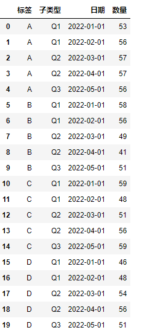
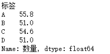
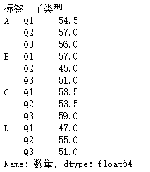
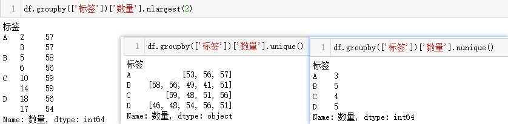
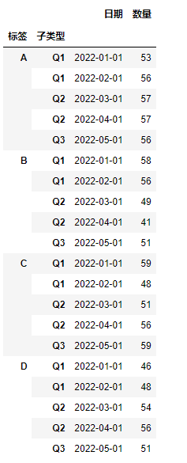
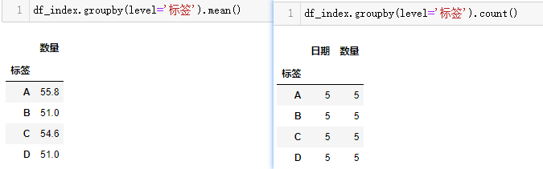
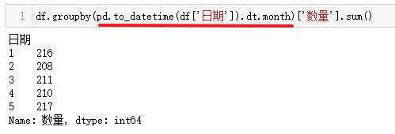
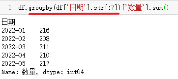
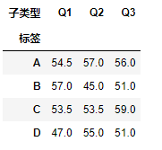

# 拯救pandas计划（23）——groupby分组聚合

最近发现周围的很多小伙伴们都不太乐意使用pandas，转而投向其他的数据操作库，身为一个数据工作者，基本上是张口pandas，闭口pandas了，故而写下此系列以让更多的小伙伴们爱上pandas。

系列文章说明：

> 系列名（系列文章序号）——此次系列文章具体解决的需求

**平台：**

- windows 10
- python 3.8
- pandas >=1.2.4

## / 数据需求

在之前的系列文章中，很多需求都有涉及`groupby`的使用，可能对突然出现的方法感到不知所措，在这对`groupby`进行简短的说明，并归纳之前已经出现的用法。  

生成数据：  

```python
import numpy as np
import pandas as pd

df = pd.DataFrame({'标签': np.repeat(['A', 'B', 'C', 'D'], 5),
                   '子类型': ['Q1', 'Q1', 'Q2', 'Q2', 'Q3'] * 4,
                   '日期': ['2022-01-01', '2022-02-01', '2022-03-01', '2022-04-01', '2022-05-01'] * 4,
                   '数量': [53, 56, 57, 57, 56, 58, 56, 49, 41, 51, 
                            59, 48, 51, 56, 59, 46, 48, 54, 56, 51]})
```

  

## / 方法说明

```python
df.groupby(
    by=None,
    axis=0,
    level=None,
    as_index: 'bool' = True,
    sort: 'bool' = True,
    group_keys: 'bool' = True,
    observed: 'bool' = False,
    dropna: 'bool' = True,
) -> 'DataFrameGroupBy'
```

- 参数上`by`和`level`必须得有一个不为空，换言之，可以使用对应列中的元素进行聚合，也可以使用索引进行聚合，`by`除了可以传入标签，由标签组成的列表，还能接受映射对象和函数，`level`能接受单索引和多级索引。  

- axis来确定聚合方向，默认是索引（0 or 'index'），可设置为列方向（1 or 'columns'）。

- as_index，是否将聚合列作为索引，sort则对聚合列进行排序，有时需要将这两个分别设置成False以达到当前聚合目的，如果聚合列中包含空值，可以设置dropna进行删除。

- group_keys能使当调用apply方法时，将聚合列作为索引作用在每一份上。

- 当observed为True时，只返回分类列，且仅当被聚合的数据框包含分类类别的列生效。  

## / 需求处理

1. 对标签列进行聚合，计算每个标签的数量平均值。  

```python
df.groupby(['标签'])['数量'].mean()
```

  

类似的，可以直接聚合两列。  

```python
df.groupby(['标签', '子类型'])['数量'].mean()
```

  

聚合条件增多了，生成的行数也多了，数字所表达的含义也会有所变化，在未筛选`数量列`之前，生成的是`DataFrameGroupBy`对象，筛选后为`SeriesGroupBy`，除了常见的统计方法外，还能进行分组去重，前几大的数，去重计数等。  

```python
df.groupby(['标签'])['数量'].unique()
df.groupby(['标签'])['数量'].nunique()
df.groupby(['标签'])['数量'].nlargest(2)
```

  

当as_index=False，还是能够使用上述方法。  

2. 对索引列聚合，计算数量列的平均值  

先将数据转换成目标源数据，设置索引

```python
df_index = df.set_index(['标签', '子类型'])
```

  

使用的参数改为`level`，这里的索引具有名称，所以将名称传入level，通常是没有的，就设置位置值，比如0,1,2...   

```python
df_index.groupby(level='标签')['数量'].mean()
```

生成的结果与列聚合一样，其余的方法类似，如果不取出`数量列`，直接进行聚合，那么会动态地对可以进行聚合的列进行求值，如对浮点型和整型可以计算平均值，大部分类型的值都能进行计数。  

```python
df_index.groupby(level='标签').mean()
df_index.groupby(level='标签').count()
```

  

3. 聚合日期  

日期所包含的信息有很多，以这份示例为例，日期列是字符串类型，想统计每天的数量，可以对日期列直接聚合相加，操作方法同上文，不再赘述，如果想统计每月的数量和，通常会统计出12月份的数据，也会想到将数据转换成日期再进行聚合。  

上文提到，`by`参数可以接受映射对象。而在pandas里日期可以调用dt.month属性获取月份。  

```python
df.groupby(pd.to_datetime(df['日期']).dt.month)['数量'].sum()
```

  

如果需要统计每年每月的数量和，可能再转换成日期稍显麻烦，可以先观察数据格式是否一致，通过切片的方式进行聚合。  

```python
df.groupby(df['日期'].str[:7])['数量'].sum()
```

  

4. 结合其他方法  

原理上是，生成的结果为`DataFrame`或`Series`类型，这两种类型的多方法使用，也就是将整个操作流程组合为一个链式调用方法。  

比如在之前出现的行转列，计算每个标签，每个子类型的数量平均值，并将子类型设置为列名称：  

```python
df.groupby(['标签', '子类型'])['数量'].mean().unstack('子类型')
```

  

5. 遍历分组  

分组结果是可迭代对象，除能直接在分组对象调用方法外，也能通过循环将每个分块取出。  

```python
for g, data in df.groupby('标签'):
    print(g, data)
```

g: 每个分组类型

data: 分组后的数据框  

## / 总结

本篇仅对之前系列文章出现的`groupby`用法进行了归纳，并对`groupby`进行简单的说明，对整个数据框进行聚合前先对数据进行总的了解，使用正确的聚合列或者方法，来获取正确结果。  


聚沙成塔，也许现在做的事不值一提，好也罢，坏也罢，然，也需谨言慎行。  

---

<p align="right">二零二二七月十九日作</p>
