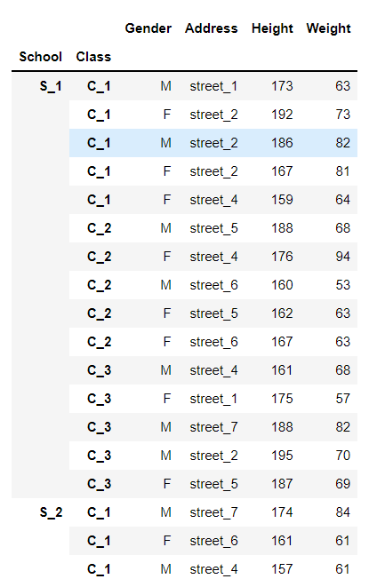
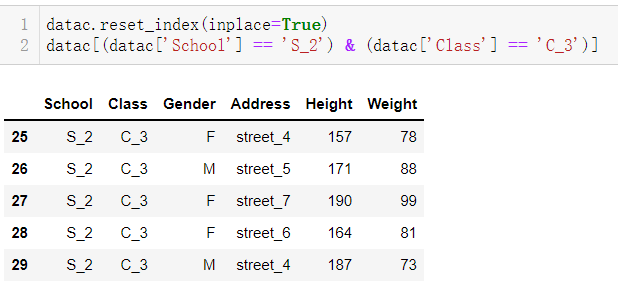
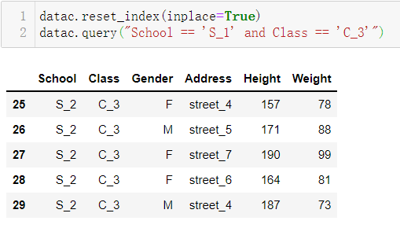
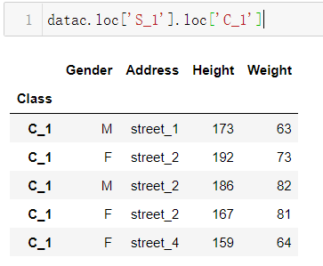
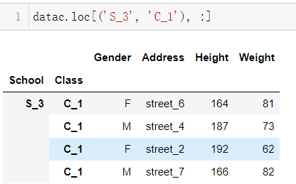
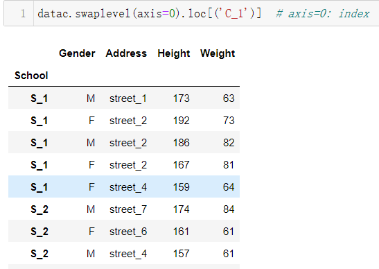

# 拯救pandas计划（3）——多级索引取值

最近发现周围的很多小伙伴们都不太乐意使用pandas，转而投向其他的数据操作库，身为一个数据工作者，基本上是张口pandas，闭口pandas了，故而写下此系列以让更多的小伙伴们爱上pandas。  

系列文章说明：

> 系列名（系列文章序号）——此次系列文章具体解决的需求  

**平台：**  

- windows 10
- python 3.8
- pandas 1.2.4

## 数据需求

给定一份多级索引数据，查找指定值。



## 需求拆解

数据提取在pandas中，或者说在python中就是索引式提取，在单层索引中采用`·.lo`或`.iloc`方法已经非常常见了，然而在索引层次多了之后却有点不知所措，也只需要将各个索引看成整体进行提取就行。

## 需求处理

### 方法一：

这里先给出一个比较笨拙的方法，先将索引进行重置为列数据，通过列取得bool条件再进行提取

```python
datac.reset_index(inplace=True)
datac[(datac['School'] == 'S_2') & (datac['Class'] == 'C_3')]
```

  
可以看到通过该类方法可以成功取到对应值

当然也可以采用`.query`方法进行条件筛选

```python
datac.reset_index(inplace=True)
datac.query("School == 'S_1' and Class == 'C_3'")
```



### 方法二：

既然为多级索引，pandas也会有对应的取值方式，既可以用链式调用的方式，也可以通过元组进行提取，首先看看多级索引的输出值：  
  
是一个MultiIndex类型数据，其元素都是元组，即也能通过元组的方式进行索引调取

这两种都一个共同的特点，从左到右，要先外层再内层，否则会报`KeyError`错误

```python
# 链式调用
datac.loc['S_1'].loc['C_1']
```



```python
# 元组作为索引调用
datac.loc[('S_3', 'C_1'), :]
```



**tips:**  

1. 多层索引，即列名上方有层次结构也可以按这种方式进行提取。  

2. 想越过外层索引提取内层索引需要交换索引顺序才能顺利提取。  
   
   ```python
   # swaplevel 交换索引层级
   datac.swaplevel(axis=0).loc[('C_1')]  # axis=0: index
   ```
   
     

## 总结

功夫再高，也怕菜刀。本例使用方法比较常规，旨在巩固基础知识，当下次遇到能够想起可以直接索引取值而不用将索引重置为列值，以高效完成数据提取任务。  

在茫茫人海中，我与你仅有一瞥，却通过你的眼睛里看到汪洋大海，我相信心灵的碰撞能带来更长久的欢快。  

---

<p align="right">于二零二二年元月十三日作</p>
